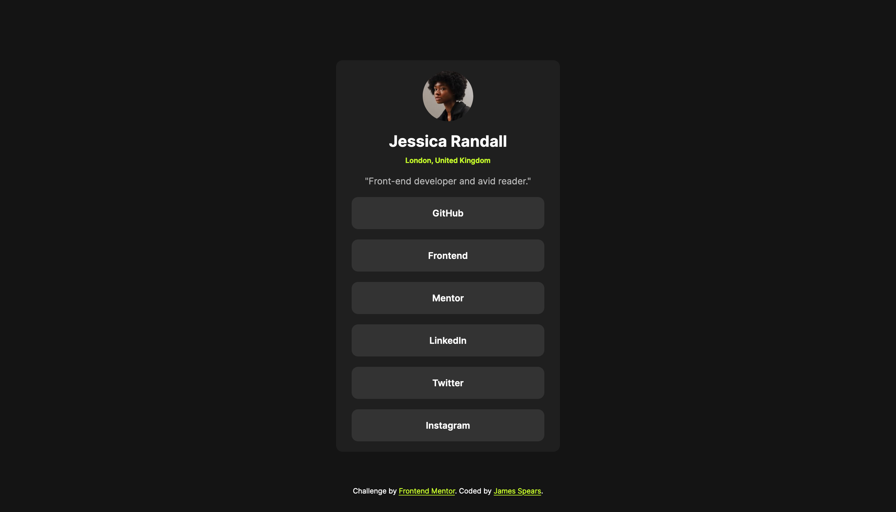

# Frontend Mentor - Social links profile solution

This is a solution to the [Social links profile challenge on Frontend Mentor](https://www.frontendmentor.io/challenges/social-links-profile-UG32l9m6dQ). Frontend Mentor challenges help you improve your coding skills by building realistic projects.

## Table of contents

- [Frontend Mentor - Social links profile solution](#frontend-mentor---social-links-profile-solution)
  - [Table of contents](#table-of-contents)
  - [Overview](#overview)
    - [The challenge](#the-challenge)
    - [Screenshot](#screenshot)
    - [Links](#links)
  - [My process](#my-process)
    - [Built with](#built-with)
    - [What I learned](#what-i-learned)
  - [Author](#author)

## Overview

### The challenge

Users should be able to:

- See hover and focus states for all interactive elements on the page

### Screenshot

### Links

- Solution URL: [https://github.com/jamesspearsv/social-links-profile](https://github.com/jamesspearsv/social-links-profile)
- Live Site URL: [https://jamesspearsv.github.io/social-links-profile/](https://jamesspearsv.github.io/social-links-profile/)

## My process

### Built with

- Semantic HTML5 markup
- CSS custom properties
- Flexbox
- Mobile-first workflow

### What I learned

While I am not a complete beginner to web development or coding, I am totally self-taught and struggle with some of the finer details. My code often lacks cleanliness and more often than not can appear "hacky". My goal in completing this project was to become more familiar with Frontend Mentor, as this was the first challenge I have completed, and to focus on writing class based styles that are reusable and modular. I think that I was able to accomplish this to some extent.

## Author

- Website - [jamesspearsv.com](https://jamesspearsv.com)
- Frontend Mentor - [@jamesspearsv](https://www.frontendmentor.io/profile/jamesspearsv)
